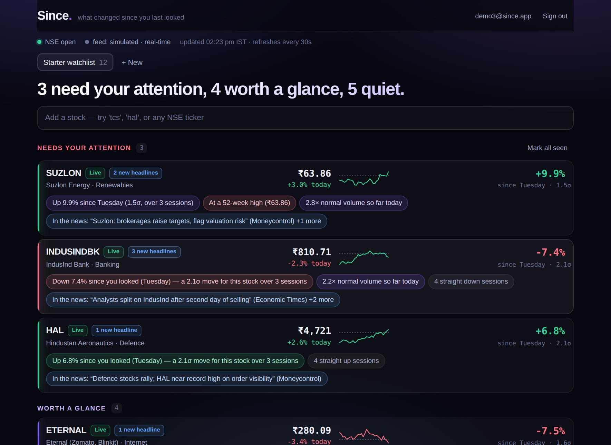
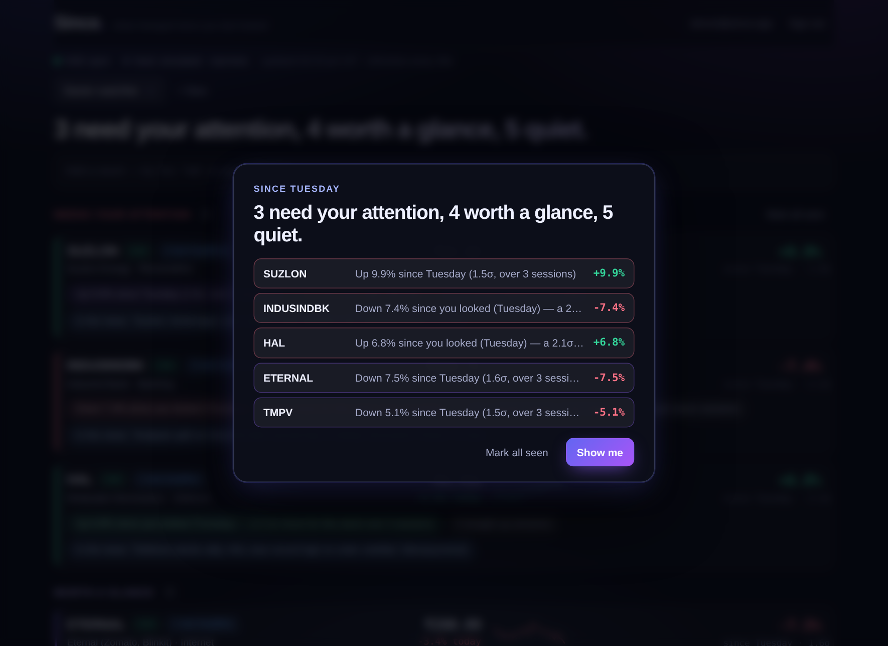
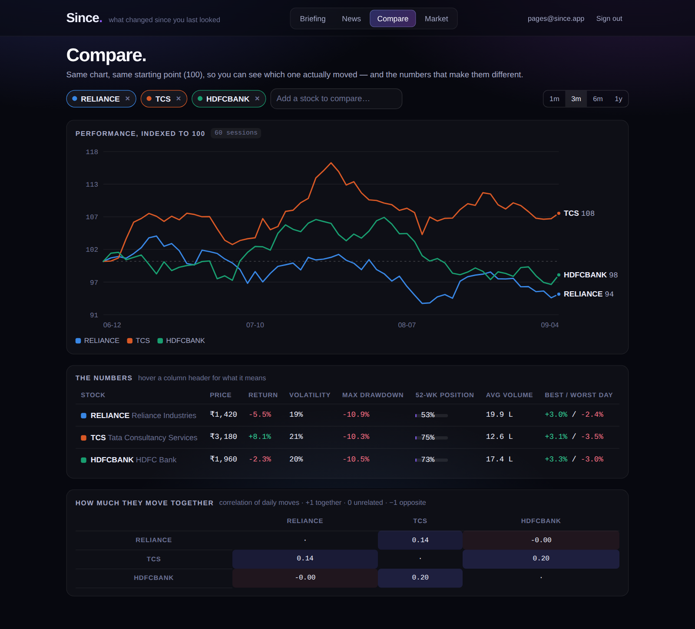
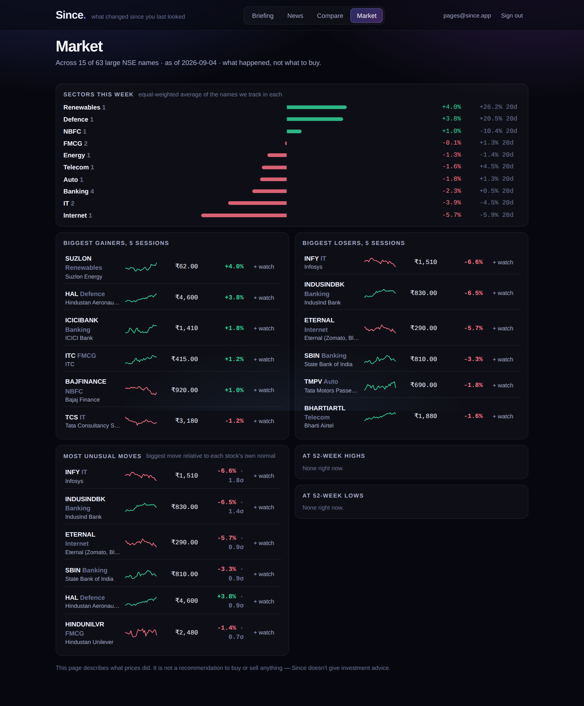

# Since — a watchlist that opens as a briefing

> Every watchlist shows you what changed since **yesterday's close**. Nobody cares about yesterday.
> You care about what changed since **you** last looked — and only about the stocks whose move was unusual *for them*.

**Since** is a smart market watchlist for NSE stocks built for Groww's CODE 2026 challenge. It tracks a watchlist, but the screen you land on is not a table of prices. It is a briefing:

```
2 need your attention, 5 worth a glance, 5 quiet.

INDUSINDBK   ₹810.76  −2.3% today          −7.4% since Tuesday · 2.2σ
  Down 7.4% since you looked (Tuesday) — a 2.2σ move for this stock over 3 sessions
  2.2× normal volume so far today · 4 straight down sessions
  In the news: "IndusInd Bank falls after RBI seeks clarification on derivatives accounting" (Mint) +2 more
```



The moment a visit starts, the briefing pops up as a summary — and on a first visit it explains that the baseline was just set and offers to rewind:



Built end-to-end: FastAPI + SQLite backend, React/TypeScript frontend, real market data (Yahoo Finance, ~15 min delayed for NSE) with a deterministic simulated feed for tests and offline demos, and free news via Google News RSS. 37 backend tests. One container.

---

## Contents

1. [The thesis](#1-the-thesis)
2. [What it does](#2-what-it-does)
3. [Run it](#3-run-it)
4. [Architecture](#4-architecture)
5. [Decisions and trade-offs](#5-decisions-and-trade-offs) ← the "how I got there" section
6. [Edge cases and failure modes](#6-edge-cases-and-failure-modes)
7. [Scaling](#7-scaling)
8. [What I deliberately did not build](#8-what-i-deliberately-did-not-build)
9. [Testing](#9-testing)
10. [API](#10-api)
11. [Next steps](#11-next-steps)

---

## 1. The thesis

The brief asks for a watchlist that helps users "quickly understand what has *meaningfully changed since they last checked*, and what deserves their attention now." Three words in that sentence carry the whole product, and the obvious watchlist gets all three wrong:

| Word | The obvious watchlist | Since |
|---|---|---|
| **since they last checked** | Shows change vs. yesterday's close. If you were away four days, you see one day. | Keeps a per-user, per-stock **baseline** — the price you last saw before you left — and diffs against *that*. |
| **meaningfully** | Fixed thresholds ("alert at ±2%"). But 2% is Tuesday for Suzlon and an event for Hindustan Unilever. | Scores every move as a **z-score against that stock's own volatility**, scaled by the number of trading sessions elapsed. |
| **deserves attention now** | A list of 30 rows, all the same size. | **Triage**: *Needs attention* / *Worth a glance* / *Quiet*. Quiet stocks collapse to one line. Each flagged stock says *why* in plain English. |

Everything else — auth, sync, resilience, scaling — exists to make those three things true reliably.

## 2. What it does

- **Create and manage watchlists.** Multiple lists, search-as-you-type over an NSE universe or any Yahoo-style ticker (validated against the feed before it is accepted).
- **Latest market information.** Price, day change, open/high/low, volume, 52-week range, 30-session sparkline — every quote stamped with its exchange time and a freshness badge (*Live / Delayed ~14 min / At close, Thu 4 Sep / Stale*).
- **Come back and see what changed.** The briefing diffs against your own baseline. Sign in from a phone and the same baseline, levels and acknowledgements are there.
- **Significance engine.** Move in σ over elapsed sessions, volume vs. 20-session average (session-fraction adjusted intraday), 52-week high/low breaches, gap opens, streaks, and crossings of price levels *you* set ("tell me if TCS falls below 3,400 — buy zone").
- **News as context.** Headlines per company (Google News RSS), diffed against the same baseline: "2 new headlines since you looked". A big move with a fresh headline shows the headline as the likely *why*.
- **Pin a tiny dashboard.** Star any stock and it sits in a strip at the top — price, today, since-you-looked, sparkline — across every watchlist. Click a tile to jump to its full card.
- **Plain language, not jargon.** "How unusual" is a word — *Ordinary / Notable / Rare / Extreme* — plus "a normal 3-session stretch for this stock is about ±3.7%". The σ is there for people who want it, in brackets. Every label in the detail panel has a hover definition, because the target user has never used a brokerage terminal.
- **Acknowledge.** "Seen it ✓" resets the baseline for one stock; "Mark all seen" for the list.
- **Honest about data.** Provider name and delay in the status strip; a banner if the primary feed is down and you're seeing fallback data; stale prices shown greyed, never hidden.
- **Time-travel demo control.** "Pretend I last looked 3 sessions ago." The core feature is invisible to a first-time visitor (no history yet) — this makes it visible in one click.

Three more pages, all built on data already in the database — no extra vendors, no API keys:

- **News** — every headline for every stock you follow, the unseen ones first, filterable per stock. Same baseline as the briefing, so "new" means new *to you*.
- **Compare** — 2–6 stocks on one chart, indexed to 100 so the lines are actually comparable, plus volatility, max drawdown, 52-week position, average volume, and a correlation matrix of daily moves.
- **Market** — what moved across ~60 large NSE names: index tiles, sector performance, biggest gainers/losers, the *most unusual* moves (σ-ranked, not %-ranked), and 52-week breaches. Every row has "+ watch" to pull it onto your list.




## 3. Run it

### Docker (recommended)

```bash
docker compose up --build
# → http://localhost:8000
```

Uses Yahoo Finance for prices with automatic fallback to the simulated feed. Login is passwordless: enter an email, the 6-digit code is shown on screen (dev mode — no email is sent).

### Local dev

```bash
# backend
cd backend && pip install -r requirements.txt
uvicorn app.main:app --reload --port 8000

# frontend (separate terminal; proxies /api to :8000)
cd frontend && npm install && npm run dev      # → http://localhost:5173

# tests
cd backend && python -m pytest -q
```

### Windows (PowerShell)

```powershell
cd backend; pip install -r requirements.txt
cd ..\frontend; npm install; npm run build; cd ..\backend
.\run.ps1            # real data → http://localhost:8000
.\run.ps1 -Demo      # offline demo with scripted events
```

### Fully offline demo

```bash
cd backend && SINCE_PROVIDER=simulated SINCE_NEWS_PROVIDER=simulated uvicorn app.main:app --port 8000
```

The simulated feed is deterministic (seeded by ticker) with a few scripted events in recent sessions — Tata Motors −5.8% on 3× volume, HAL grinding to a 52-week high, IndusInd two red days — and headlines timed to match. Click **Create sample watchlist**, then **3 sessions ago**.

All settings are environment variables prefixed `SINCE_` — see `backend/.env.example` and `backend/app/config.py`.

## 4. Architecture

```
                         ┌─────────────────────────────────────────────────┐
  browser (React/TS)     │  FastAPI                                        │
  ─────────────────      │                                                 │
  login (magic code) ───►│  auth ─── sessions (token hash, device label)   │
  X-Visit-Id header ────►│  engine/baselines ── visit → commit baseline    │
  GET /briefing ────────►│  engine/briefing ── assemble + rank             │
                         │        └─ engine/significance (pure functions)  │
  POST items ──If-Match─►│  watchlists ── conditional UPDATE → 409         │
                         │                                                 │
                         │  market/service ── refresh loop (asyncio task)  │
                         │     │  distinct symbols across ALL users        │
                         │     │  hot symbols 60s · cold 180s · closed 15m │
                         │     ▼                                           │
                         │  market/resilient ── circuit breaker per source │
                         │     ├── yahoo      (v8 chart; quotes + bars)    │
                         │     └── simulated  (deterministic GBM + events) │
                         │  news chain ── google-news RSS → simulated      │
                         │                                                 │
                         │  market/store ── monotonic-time upserts         │
                         └───────────────┬─────────────────────────────────┘
                                         ▼
                          SQLite (WAL)  — quotes · daily_bars · news_items   ← shared, keyed by symbol
                                        — users · sessions · watchlists ·
                                          baselines · price_levels          ← per user
```

**Request path.** `GET /watchlists/{id}/briefing` reads the stored quotes, bars, news and the user's baselines/levels for that list, runs `assess()` per symbol, and returns tiers + reasons. It never calls a market data vendor. Latency is a few SQLite reads regardless of how many users exist.

**Refresh path.** One background loop (`MarketService.tick`) computes the set of distinct symbols across all watchlists and levels, decides what is due, fetches in batches, and upserts. Users share symbols; symbols are fetched once.

**Code map**

```
backend/app/
  engine/significance.py   the scoring model — pure, tested, ~250 lines
  engine/baselines.py      visits, baselines, acknowledge, rewind
  engine/briefing.py       assembly: quotes+bars+news+baselines → BriefingOut
  market/provider.py       MarketDataProvider interface (QuoteData, BarData)
  market/yahoo.py          Yahoo Finance v8 chart provider
  market/simulated.py      deterministic feed + scripted events
  market/news.py           NewsProvider: Google News RSS + simulated
  market/resilient.py      circuit breaker + fallback chain
  market/store.py          the only writer of market data; conflict rules live here
  market/service.py        the refresh loop and tiering policy
  market/calendar.py       NSE sessions, holidays, sessions_between()
  routers/                 auth, watchlists (optimistic concurrency), briefing, misc
frontend/src/
  App.tsx                  briefing view, polling, conflict handling
  components/StockCard.tsx card, detail drawer, levels, news
  api.ts                   token, visit id, If-Match, ConflictError
```

## 5. Decisions and trade-offs

### 5.1 What counts as a meaningful change

A move matters in proportion to how unusual it is *for that stock*, over the number of sessions since *you* last looked:

```
z = ln(price / baseline_price) / (σ_daily · √sessions)
```

- `σ_daily` is the stock's own trailing 20-session volatility of log returns (floored at 0.4%/day so indices and mega-caps don't produce absurd z; falls back to 1.8%/day with a visible "limited history" note when there are fewer than 8 bars).
- `sessions` comes from the NSE calendar, not wall-clock days. Friday close → Monday morning is one session, not three days.
- Intraday, the current session counts as its elapsed fraction (min 0.25), so a 3% move by 10:00 am is scored as more unusual than 3% by 3:25 pm.

|Tier|Rule|
|---|---|
|**Needs attention**|\|z\| ≥ 2, or a level you set was crossed, or a 52-week high/low, or \|z\| ≥ 1.5 with ≥ 2× volume|
|**Worth a glance**|\|z\| ≥ 1, or ≥ 2× volume, or a gap open > 2σ, or a 4+ session streak, or ≥ 3 new headlines|
|**Quiet**|everything else — shown as one collapsed line each|

Discrete events sit on top of the z-score because they carry information a return cannot: they are about *where* the price is, not how far it moved. A stock can drift 0.3% and still be "at a 52-week high", and that is worth a line.

**Why not a fixed % threshold?** It is the single most common mistake in "smart" watchlists. A 3% move is a 0.9σ yawn for Suzlon and a 2.7σ event for Hindustan Unilever. `test_same_percent_move_is_judged_by_the_stocks_own_volatility` pins this.

**Why not an ML model?** There is no labelled data for "the user found this meaningful", and a model nobody can explain is worse than a formula everyone can. The formula is one sentence, every reason chip shows its inputs (`2.2σ`, `2.2× volume`), and the seam for a learned ranker is `assess()` → `score`.

### 5.2 Since *when*? Visits and baselines

The obvious implementation — "record the price whenever the user loads the page" — resets the diff every 30 seconds while they are sitting on it. The baseline has to be what they saw *before they left*.

- A **visit** is a run of requests with the same client-generated `X-Visit-Id` (per browser tab) and no gap longer than 30 minutes.
- Within a visit, each briefing records what they saw as *pending*.
- A new visit (new tab, reopened browser, or 30 min idle) promotes pending → committed. The briefing now diffs against the last thing they saw before leaving.
- "Seen it ✓" commits immediately. Adding a symbol commits the current quote ("since you added it").
- Both the market time (`as_of`) and the wall time (`seen_at`) of the baseline are stored: the first drives the maths (sessions elapsed, "no new prints since you looked"), the second drives the wording ("since Tuesday").

Baselines are per user, not per session, so your phone knows what you saw on your laptop. `test_baseline_advances_on_new_visit_not_on_refresh` and `test_idle_timeout_starts_a_new_visit_even_with_same_visit_id` cover the state machine.

### 5.3 What to surface, and how

- **Headline first.** "2 need your attention, 5 worth a glance, 5 quiet." If nothing has traded since you left: "No new prices since you last looked — 1 still stands out." The screen answers the question before you scroll.
- **Reasons, not numbers.** Every flag is a sentence with its evidence inline: *Down 7.4% since you looked (Tuesday) — a 2.2σ move for this stock over 3 sessions.* Ordered by importance: the move, then levels, range, volume, gap, streak, news.
- **Quiet is a feature.** A 30-stock list where 25 are quiet should look like five cards and a short list — not thirty cards.
- **News is context, not a signal.** A single fresh headline attaches to an existing flag as the likely "why". It does not create a flag on its own unless there are three or more since you looked (unusual news flow). No sentiment model: a classifier trained on nothing would be noise dressed as insight.
- **The sparkline carries the baseline** as a dashed line, so "where was it when I looked" is visible without reading a number.
- **Words before numbers.** An early tester (me, before I'd used a brokerage app) didn't know what "0.07σ" meant. Standard deviation is a statistics word, not a finance word. The detail panel now leads with *Ordinary* / *Notable* / *Rare* / *Extreme* and a sentence — "a normal day for this stock is about ±0.9%" — and keeps σ in brackets for those who want it. Volume, day range, open, previous close and 52-week range are what every brokerage app shows, so they stay, with hover definitions.

### 5.4 Market-relative, sector-relative, and what I refused to add

The single biggest confounder in "is this move meaningful?" is the market itself. §6 covers the mechanics; the product point is that a briefing which flags all twelve of your stocks on a red day is worse than useless. Nifty context turns "everything is down" into "everything is down *because the market is down*, except HAL, which went up."

The Market page extends the same idea outward: sector aggregates answer "is this an IT problem or an Infosys problem", and the *most unusual moves* list ranks by σ rather than by percent, so it surfaces a 2.4σ move in a sleepy FMCG name over a routine 6% swing in a small-cap.

**What I refused to build, and why it matters here:**

- **"Investment opportunities" / buy ideas.** Recommending securities is a regulated activity (SEBI Research Analyst / Investment Adviser regulations). A hackathon project that says "these 5 stocks look attractive" is either fabricating an opinion it can't defend or quietly practising unlicensed advice. The Market page shows *what happened* and labels itself: "This page describes what prices did. It is not a recommendation." Discovery without advice is a real product; a screener that pretends to be a robo-adviser is not.
- **An LLM chatbot for "ask about stocks."** It needs an API key nobody reviewing this repo has, it costs money per query, it can hallucinate a number the rest of the app got right from a real feed, and it dilutes the thesis. The deterministic explainer *is* the analysis: "2.2σ for this stock over 3 sessions, 2.9× normal volume, and here's the headline that landed in the same window." It works offline, costs nothing, and can be defended line by line.
- **Fundamentals (P/E, EPS, margins) and earnings dates.** Genuinely relevant — these drive most large single-day moves — but not available from a keyless feed any more. Documented as a next step rather than half-faked.

### 5.5 State across sessions and devices

- **Server-side state, always.** Watchlists, baselines, levels, acknowledgements live in the database keyed by user. The client holds only a token (localStorage) and a visit id (sessionStorage). Sign in anywhere, same state.
- **Passwordless auth** (email → 6-digit code → bearer token). The brief cares about identity across devices, not credential storage. Codes are single-use, hashed, expire in 10 minutes, and lock after 5 wrong attempts; tokens are 256-bit random and only their SHA-256 is stored. `send_code()` is the one-function seam for a real email provider; in dev the code is returned by the API.
- **Sessions carry a device label** ("Chrome on Windows", "phone"), listed in the status strip. It makes the multi-device story visible rather than claimed.

### 5.6 Concurrent edits (race conditions)

Two devices editing one watchlist is the concrete race the brief hints at. Every watchlist has a `version`. Writes may carry `If-Match: <version>`; the server bumps with a **conditional UPDATE** — `UPDATE watchlists SET version = version + 1 WHERE id = ? AND version = ?` — and checks the row count. Zero rows means someone else got there first: the client gets a **409 with the current state**, adopts it, tells the user, and lets them retry. No lost updates, no locks held across requests, identical on SQLite and Postgres.

Adds and removes are idempotent, so a retried request after a network blip cannot double-add. Clients that omit `If-Match` get last-writer-wins, which is right for a single-device user.

### 5.7 Stale, delayed and conflicting data

Every stored quote has two timestamps: `as_of` (the exchange time of the print) and `fetched_at` (when we received it). That distinction drives everything below.

|Situation|Behaviour|
|---|---|
|Yahoo's NSE feed is ~15 min behind|Yahoo's payload declares its own lag (`exchangeDataDelayedBy`); we store it per quote and the badge says *Delayed 15 min (feed)*. Yahoo stamps delayed prints with a recent timestamp, so clock arithmetic alone would wrongly say "Live" — the vendor's declaration wins. A broker feed that declares 0 would earn the *Live* badge.|
|Market closed|Badge says *At close, Thu 4 Sep*; the refresh loop slows to every 15 min; "since you looked" says *no new prints — market closed* instead of inventing a 0.0% move.|
|Provider slow; an older response lands after a newer one|**Market time only moves forward.** A quote with `as_of` older than the stored one is discarded (`test_quote_never_moves_backwards_in_market_time`).|
|Two sources disagree on the same print|Primary source wins; the disagreement is logged with both values. If we only had the fallback's number, a primary print at the same time replaces it.|
|Provider down|Circuit breaker opens after 3 failures, traffic moves to the fallback, a banner says so. If every source is down, the last good snapshot is served and marked *Stale — last print 40 min ago*. The UI never goes blank.|
|Re-fetched history disagrees with stored bars (corrections)|Bars are upserted by `(symbol, date)`; a corrected close replaces, never duplicates.|
|Very new listing / short history|σ falls back to a default and the card says *Limited price history — volatility estimate is a default*.|
|Ticker renamed or delisted (Zomato → ETERNAL, Tata Motors → TMPV/TMCV in 2025)|A `SymbolNotFound` is *not* a provider failure: it does not trip the breaker and is never answered with fallback data (that would be made-up prices for a real ticker). Two consecutive misses mark the symbol unavailable, polling stops, and the row says so and suggests fixing the ticker. Old names people still type are aliased to the new ones in search.|
|A stock falls 3% on a day Nifty fell 2.5%|Not news about the stock. The engine tracks `^NSEI` for every user, computes the index's move over *the same window as that user's baseline*, and demotes a move one tier when ≥70% of it is the market — with a reason chip saying so. A stock moving *against* the market gets promoted instead. Level crossings and 52-week breaches are stock-specific and never discounted.|
|Yahoo's `chartPreviousClose`|Is the close before the *chart range*, not yesterday's. Day change is derived from the daily rows instead — a wrong "prev close" makes every day-change figure wrong.|
|Same symbol wanted by the refresh loop, a sample-list warmup and an "add symbol" at once|An in-flight set per fetch kind: one request goes out, the others skip.|

### 5.8 Why these technologies

- **FastAPI + SQLAlchemy + SQLite (WAL).** One process, one file, zero setup for a reviewer; `SINCE_DATABASE_URL=postgresql+psycopg://…` is the only change for Postgres (driver included). Requires Python 3.10+. SQLAlchemy 2.0 typed models keep the schema readable.
- **React + Vite + TypeScript, no UI framework.** ~900 lines of components, hand-written CSS. A component library would have cost more in bundle size and fighting defaults than it saved.
- **Yahoo Finance v8 chart endpoint.** Keyless, covers NSE/BSE, one endpoint for quotes and history (the v7 quote endpoint now needs a cookie+crumb dance that breaks unpredictably — one endpoint, one failure mode).
- **Google News RSS.** Keyless, good Indian business-press coverage, gives publisher and timestamp.
- **No Redis, no Celery, no websockets.** See §8.

## 6. Edge cases and failure modes

Beyond §5.6:

- **Unknown ticker.** Adding `FOO` asks the provider first; 422 if it does not resolve. Known tickers are accepted immediately and data is fetched synchronously so the card is never empty.
- **Empty and first-run states.** New user → offer a sample list; empty list → prompt; symbol just added → "Waiting for first quote…" rather than a broken row.
- **Weekends and holidays.** `sessions_between()` walks the NSE calendar; holidays are a data list (`market/calendar.py`) because exchanges publish them yearly. A missed holiday costs one over-counted session, never a wrong price.
- **Session boundary.** The moment the market closes, bars for the just-finished session are fetched so the 52-week range and σ include today.
- **Scheduler crash.** The loop catches everything per tick and keeps going; `/api/health` exposes last tick time, breaker states, and the newest quote time so an operator can see it is alive.
- **Auth.** Expired/revoked token → 401 → client clears it and shows login. Wrong code ×5 → code burned, must request another. Another user's watchlist id → 404, not 403 (don't confirm existence).
- **Browser storage unavailable** (private mode, blocked). Every read/write is wrapped; the app works without it, you just get a new visit each load.
- **Ordering stability.** Quiet items keep the user's own order; flagged items sort by tier then score, so the list does not reshuffle on every poll.

## 7. Scaling

The design choices that matter, in order of leverage:

1. **Fetch per symbol, not per user.** Cost of the refresh loop is O(distinct symbols), not O(users × list size). 10,000 users watching RELIANCE is one request a minute.
2. **Diff on read from snapshots.** The briefing is a handful of indexed reads plus pure computation; no per-user polling, no fan-out on price change. 50 symbols × 260 bars is ~13k rows, a few ms.
3. **Attention-tiered polling.** Symbols someone has looked at in the last 15 minutes refresh at the base interval; cold symbols 3× less often; everything slows to 15 min when the market is closed. Long-tail symbols nobody is watching cost almost nothing.
4. **Batching + concurrency caps** on the provider (20 symbols per batch, 6 concurrent connections) keep us under free-tier rate limits.
5. **Stateless request path.** Sessions are DB rows, not in-memory; any number of API replicas can serve requests.

What changes at real scale, and where:

|Bottleneck|First move|Touches|
|---|---|---|
|SQLite single writer|`SINCE_DATABASE_URL` → Postgres|config only|
|One refresh loop|Run N workers; claim due symbols with `SELECT … FOR UPDATE SKIP LOCKED` (or a Redis lease)|`service.tick()` — the loop's only state is `fetched_at` in the DB, by design|
|Briefing recompute per poll|Cache `assess()` output per `(symbol, quote.as_of)`; per-user part is just the baseline subtraction|`engine/briefing.py`|
|Polling latency|Push quote updates over SSE/WebSocket; the diff logic is unchanged|frontend + one endpoint|
|Vendor limits|Paid feed behind the same `MarketDataProvider` interface|one new file in `market/`|

## 8. What I deliberately did not build

The rubric asks where to keep things simple. These were considered and cut on purpose:

- **Real-time push.** 30-second polling is fine for a 15-minute-delayed feed; websockets would add a moving part to defend for no user-visible gain today.
- **A message queue / Celery / Redis.** One asyncio loop with DB-backed state does the job for thousands of users; the migration path is documented above, not pre-built.
- **Sentiment analysis on news.** No labelled data, unexplainable output, and a wrong "negative" tag is worse than no tag.
- **Buy/sell ideas and an LLM chatbot.** Both were asked for; both were declined on purpose. See §5.4 — one is regulated advice, the other is an API key the reviewer doesn't have plus a hallucination risk on top of numbers the app otherwise gets right.
- **Password auth, OAuth, email delivery.** The rubric is about state across devices; magic codes deliver that in 80 lines. The email seam is one function.
- **Portfolio/P&L.** It's a watchlist. Holdings would double the data model for a feature the brief did not ask for.
- **Per-user notification channels** (push, email digests). The *engine* for "what's worth telling you" is built; delivery is a product decision I'd validate before building.
- **Reordering UI (drag-and-drop).** The API supports it (`PUT /items`), the UI doesn't yet — the attention ordering matters more than manual order for this product.

## 9. Testing

```
cd backend && python -m pytest -q      # 37 tests, ~6s, no network
```

|File|Covers|
|---|---|
|`test_significance.py`|the scoring model: per-stock volatility, session scaling, levels both directions, 52w breach on a tiny move, session-adjusted volume, gap detection, short-history fallback, σ floor, reason ordering|
|`test_market_infra.py`|NSE calendar (weekends, holidays, session counting), store conflict rules (monotonic time, primary wins), bar upsert idempotency, circuit breaker state machine, failover + degraded status, symbol-not-found does not trip the breaker or fall back|
|`test_api.py`|auth (bad/reused codes, 401), two devices share state, 409 with current state + successful retry, idempotent add/remove, tenant isolation, baseline advances on new visit not refresh, idle timeout, acknowledge, rewind, level crossing in the briefing, news diffed against baseline, briefing survives provider outage, unknown tickers rejected and delisted ones flagged, old ticker names resolve, vendor-declared delay beats the "Live" label|

The simulated provider makes every test deterministic and network-free. The Yahoo and Google News providers are exercised manually (`SINCE_PROVIDER=yahoo`).

## 10. API

All under `/api`. Auth via `Authorization: Bearer <token>`. Full OpenAPI at `/docs`.

|Method|Path|Notes|
|---|---|---|
|POST|`/auth/request-code`, `/auth/verify`|passwordless login; `device_label` names the session|
|GET|`/auth/me`, `/auth/sessions`|sessions list shows every device|
|GET/POST|`/watchlists`|list / create|
|POST|`/watchlists/sample`|starter list, data pre-warmed|
|PATCH/DELETE|`/watchlists/{id}`|rename (If-Match) / delete|
|POST/DELETE/PUT|`/watchlists/{id}/items[/{symbol}]`|add / remove / reorder — all accept `If-Match`, return 409 + current state on conflict|
|GET|`/watchlists/{id}/briefing`|the product; send `X-Visit-Id`|
|POST|`/watchlists/{id}/ack`|`{symbols: [...]}` or `{symbols: null}` for all|
|POST|`/watchlists/{id}/demo/rewind`|`{sessions: n}` — set baseline to the close n sessions ago|
|GET/POST/DELETE|`/pins[/{symbol}]`|the always-watch set, across lists|
|GET|`/pins/board`|pinned symbols scored like the briefing, in pin order|
|GET|`/news?days=`|every headline across the user's symbols, flagged new vs. their baseline|
|GET|`/compare?symbols=&sessions=`|rebased series, volatility, drawdown, correlation matrix|
|GET|`/market`|indices, sector aggregates, movers, unusual moves, 52-week breaches|
|GET/POST/DELETE|`/levels[/{id}]`|price levels with direction + note|
|GET|`/symbols/search?q=`|universe search|
|GET|`/health`|market state, provider breakers, scheduler liveness|

## 11. Next steps

In the order I would do them:

1. **Learned ranking on top of the formula.** Log which flagged items users expand or acknowledge quickly vs. ignore; fit per-user weights for the score components. The formula stays as the explainable prior.
2. **Sector/index-relative moves.** "Down 3% on a day the Bank Nifty fell 3%" is not news. Subtract the sector's move before scoring.
3. **Push delivery** of the briefing when something crosses into *Needs attention* while you're away — the engine already produces exactly the payload.
4. **Postgres + multi-worker refresh** as described in §7, when symbol count × users makes one loop the bottleneck.
5. **Earnings calendar** as a first-class event ("results on Thursday") — the one scheduled thing every watcher wants to know.
6. **Sector-relative scoring inside the briefing.** The Market page computes sector aggregates already; feeding "IT fell 3% today" back into `assess()` would discount an Infosys move the same way Nifty does now. One function, needs a proper sector index rather than my equal-weighted proxy.
7. **A real-time broker feed** (Zerodha Kite Connect, Groww API) behind the same `MarketDataProvider` interface — one new file — so the *Live* badge is earned rather than declared.

---

*Built by Aadhya Shetty for Groww CODE 2026.*
